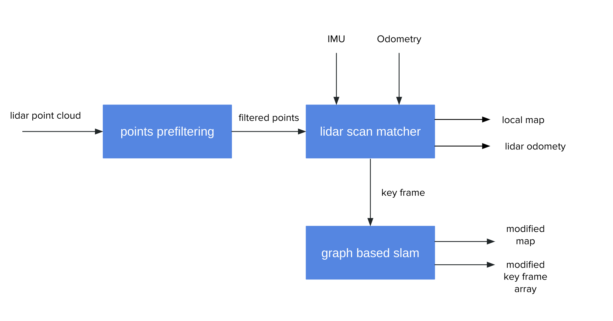

# LiDAR Graph SLAM

**InProgress**

## System OverView


## 1. Install

### Build lidar_graph_slam

```bash
mkdir -p ~/ros2_ws/src
cd ~/ros2_ws/src
git clone --recursive git@github.com:RyuYamamoto/lidar_graph_slam.git
cd ../
rosdep install -y --from-paths src --ignore-src --rosdistro $ROS_DISTRO
colcon build --symlink-install --cmake-args -DCMAKE_BUILD_TYPE=Release
```

## 2. run
```bash
ros2 launch lidar_graph_slam lidar_graph_slam.launch.xml
```

[](https://www.youtube.com/watch?v=hhWxuyCu7Us)

## ToDo
- [x] graph based SLAM(loop detect)
- [ ] save map
- [ ] improve loop detection
- [ ] implement other lidar odometry algorithm
- [ ] use FPFH
- [ ] use original KD-Tree
