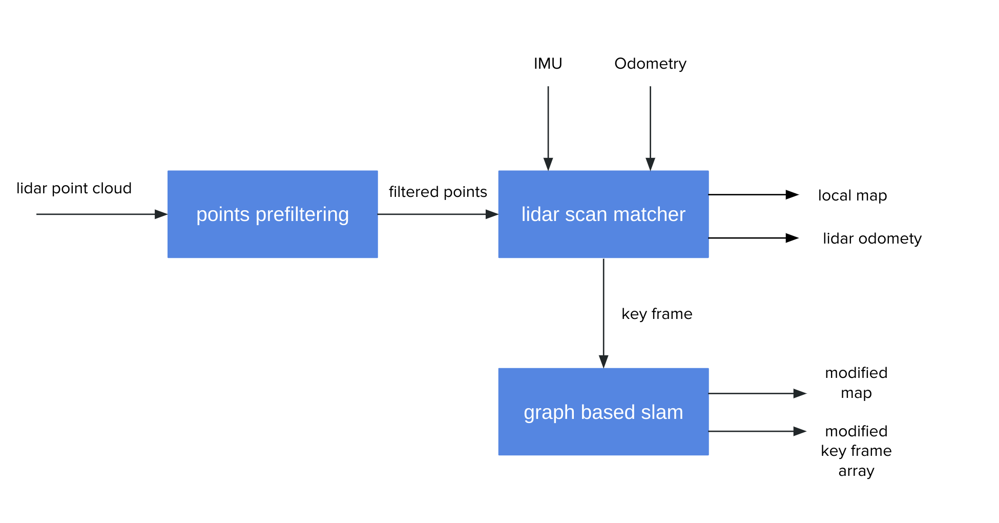

# LiDAR Graph SLAM

**InProgress**

## Demo

<video src="https://github.com/RyuYamamoto/lidar_graph_slam/raw/main/doc/lidar_slam.mp4" controls width="640"></video>

## System OverView


## 1. Install

### Build lidar_graph_slam

```bash
mkdir -p ~/ros2_ws/src
cd ~/ros2_ws/src
git clone --recursive git@github.com:RyuYamamoto/lidar_graph_slam.git
cd ../
rosdep install -y --from-paths src --ignore-src --rosdistro $ROS_DISTRO
colcon build --symlink-install --cmake-args -DCMAKE_BUILD_TYPE=Release
```

## 2. run
```bash
ros2 launch lidar_graph_slam lidar_graph_slam.launch.xml
```
## 3. save map
```bash
ros2 service call /save_map lidar_graph_slam_msgs/srv/SaveMap "{resolution: 0.2, path: "<MAP PATH>"}"

```

## ToDo
- [x] graph based SLAM(loop detect)
- [x] save map
- [ ] improve loop detection
- [ ] implement other lidar odometry algorithm
- [ ] use FPFH
- [ ] use original KD-Tree
